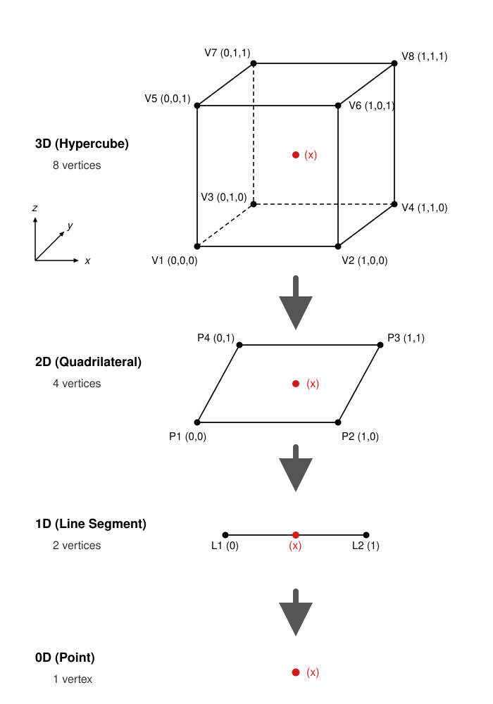

********************************************
On-device N-dimensional Linear Interpolation
********************************************

Introduction
============

When there are cases where analytical function evaluations from particle properties are not tenable (eg. TRIM data), pre-calculated grids of function evaluations at a limited set of discrete points are usually the method used to approach the problem. Each dimensional component of the coordinates of these points corresponds to a value of a particle property, such as the locally sampled fluid density or locally sampled fluid temperature ("locally sampled" here just means sampled at the particle location). A pre-requisite for the pre-calculated grid is that each axis must be sorted to be either monotonically increasing or decreasing.

The method available in VANTAGE-Reactions to retrieve arbitrary function evaluations from a pre-calculated grid is to use a series of nested hypercube contractions via 1D linear interpolations. The general method is outlined in this paper Murman_S_apnum_jun13_.

.. _Murman_S_apnum_jun13: https://www.nas.nasa.gov/assets/nas/pdf/staff/Murman_S_apnum_jun13.pdf

Overview of the interpolation method
====================================

To start with, a desired intermediate point (the desired function evaulation) can be thought of as having coordinates where each dimensional component is the value of a particle property (eg. locally sampled electron temperature) that would be used to calculate the function evaluation.
Initially, a bounding box (in the shape of a N-D hypercube) is constructed that encloses the intermediate point in question and whose vertices are known fixed points (function evaluations) on the rectilinear grid.

The "origin" of this bounding box is where the dimensional components of the coordinates of that point are largest that are possible whilst still being less than the dimensional components of the coordinates of the intermediate point. For example, if the intermediate point has coordinates (3.4, 2.7) then in a grid where all of the dimensions range from 0-5 with a spacing of 0.5, then the coordinates of the "origin" point for the bounding box would be (3, 2.5).

For the sake of interpretability it's useful to work with indices of the grid rather than the actual axis values. So for this example that "origin" point would have indexed coordinates of (6, 5).

Every other point in the bounding box will have coordinates that maximally differ from the "origin" point by 1 index in each direction. For example, for the (6, 5) "origin" point, the other points would have indexed coordinates (6, 6), (7, 5) and (7, 6).

Given the requirement for the axes of the grid to be sorted (monotonically increasing or decreasing), the vertices of the bounding box will have coordinates where each dimensional component is either greater or lesser than the corresponding dimensional component of the coordinates of the intermediate point.

From here, a recursive contraction is performed where linear interpolation is performed for each dimensional component. An example of a contraction from a 3D grid shown here:

The mathematical steps for the first contraction (for 3D->2D) would be:

 .. math::
    f(P1) = \text{linear\_interp}(x_2, V1_2, V5_2, f(V1), f(V5))\\
    f(P4) = \text{linear\_interp}(x_2, V3_2, V7_2, f(V3), f(V7))\\
    f(P2) = \text{linear\_interp}(x_2, V2_2, V6_2, f(V2), f(V6))\\
    f(P3) = \text{linear\_interp}(x_2, V4_2, V8_2, f(V4), f(V8))

The subscript for any terms going forward will denote the axis in question (x-axis - 0, y-axis - 1, z-axis - 2).
To take just the first one of these interpolations, the point :math:`P1` has no z-axis component and :math:`V1` and :math:`V5` only differ by 1 in the z-axis. Therefore the full form of the calculation of :math:`f(P1)` would be:

 .. math::
    f(P1) &= m \cdot x_2 + c \\
    m     &= \frac{f(V5) - f(V1)}{V5_2 - V1_2} \\
    c     &= f(V1) - m \cdot V1_2

This is effectively what the :math:`\text{linear\_interp(...)}` function is doing. Following this, the 2D->1D contraction would be:

 .. math::
    f(L1) = \text{linear\_interp}(x_1, P1_1, P4_1, f(P1), f(P4))\\
    f(L2) = \text{linear\_interp}(x_1, P2_1, P3_1, f(P2), f(P3))

and similarly the final contraction would be:

 .. math::
    f(x) = \text{linear\_interp}(x_0, L1, L2, f(L1), f(L2))

The subscripts for :math:`L1` and :math:`L2` are omitted since they're 1D points and the subscripts would be redundant.

This method can be extended to any arbitrary number of dimensions and scales (in terms of number of calls to :math:`\text{linear\_interp}`) as :math:`O(2^n - 1)` where :math:`n` is the number of dimensions.

Multi-valued function evaluations
=================================

This method can also be extended to the case where the function evaluation for each grid point might be multi-valued (as is the case for TRIM data). The flow is mostly identical but instead of evaluating for just one :math:`f(x)`, it might be evaluating for :math:`f(x)_0`, :math:`f(x)_1`, etc. (note the subscripts here are for denoting the different values of f(x) not the dimensions). Each component is interpolated individually, assuming that no component's calculation depends on another, they should only depend on the particle properties that the grid coordinates represent and potentially other external values like random numbers.

Extrapolation
=============

If the desired point has coordinates either partially or fully outside of the valid range of any/all dimensions of the pre-calculated grid then a choice must be made as to how to handle this. The options for this in VANTAGE-Reactions are:

  - Continue with the linear interpolation using the gradient and intercept calculation from the edge of the grid.
  - Clamp the function evaluation to zero if any dimensional components of the coordinates of the desired point are outside the grid.
  - Clamp the function evaulation to be as if it were calculated from the grid points at the edge of the grid (no gradient or intercept continuation).

Limitations
===========

Whilst being quite powerful, this method does have some limitations. Chiefly, it's quite sensitive to the sparseness of the pre-calculated grid. If the grid is too sparse then the linear interpolation will introduce inaccuracies that effectively come from the approximation of a constant linear gradient between points in the hypercube. It also requires monotonicity of every dimension of the grid.

Grid construction
=================

There is an expectation that the :class:`ReactionDataBase`-derived object that is an input of :class:`InterpolateData` has the correct construction in the sense that the on-device :func:`calc_data` has the correct form of arguments and outputs. Specifically the form of :func:`calc_data` should follow the second definition in :class:`ReactionDataBaseOnDevice`.

Cartesian case
--------------

There are helper classes that are available in VANTAGE-Reactions for constructing the necessary grid objects for :class:`InterpolateData`. For example, if the grid in question is a standard cartesian grid of single-valued function evaluations, then :class:`GridDescriptor` and :class:`CartesianGridData` are available.

In short, the :class:`GridDescriptor` takes in an array of vectors (where each vector contains all of the coordinates of each dimension) and a lambda that is set up to return the value of the grid at a given set of coordinates. This lambda can be a computation or can just get a value from a look-up table.

The resulting :class:`GridDescriptor` object can then be passed to :class:`CartesianGridData` (which contains the crucial :func:`calc_data` in the on-device object) and this is the object that is then passed to :class:`InterpolateData`.

For convenience, the ``dims_vec`` and ``ranges_vec`` that are needed for :class:`InterpolateData` can also be retrieved from the :class:`GridDescriptor` object via getters (ie. :func:`get_interp_dims` and :func:`get_flat_ranges`).

TRIM case
---------

There is one more helper specifically for TRIM data evaluation. The interface for the construction of :class:`TrimEvalData` from a :class:`GridDescriptor` object is similar to :class:`CartesianGridData` (but with an optional ``properties_map`` argument).

The key difference is in the construction of the :class:`GridDescriptor` object. There's an additional argument that's needed for specifying the size of each dimension associated with the TRIM tables.

The lambda used for constructing :class:`GridDescriptor` must also have a specific form, which now must return a concatenated vector that represents a TRIM table at a given set of coordinates. The length of said vector can be thought of as :math:`\sum_{i = 0}^{n}\left(\prod_{j=0}^{j=i}T_j\right)`, where :math:`n` is the number of TRIM dimensions.

For example, if the TRIM dimensions have sizes :math:`(5, 5, 5)` then the length of the vector returned by the lambda would be: :math:`5 + (5 \times 5) + (5 \times 5 \times 5) = 155`.

Usage (single-valued function)
==============================

The implementation of the interpolation is in :class:`InterpolateData` which inherits from :class:`CompositeData`. This is due to how the access to the pre-calculated grid is managed. For flexibility, rather than passing a full grid to the host-side :class:`InterpolateData` object, a :class:`ReactionDataBase`-derived object is passed, which will have a :func:`calc_data` that can retrieve values at coordinates that correspond to particle property values as described in `Grid construction`_. This can be a simple retrieval from a look-up table or something more complicated like doing a limited set of calculations or even incorporating samples from a random distribution.

A few pre-requisites for the construction of :class:`InterpolateData`:

  - ``output_ndim``, a ``size_t`` template parameter that specifies the number of outputs of the grid function. In the case of a single-valued function this would be 1.
  - ``interp_ndim``, a ``size_t`` template parameter that specifies how many dimensions out of the total number of dimensions of the grid to interpolate.
  - ``non_interp_ndim``, a ``size_t`` template parameter that is effectively the inverse of ``interp_ndim`` (default value is 0).
  - ``dims_vec`` , a ``std::vector<size_t>`` that contains the lengths of the extent of each dimension in the grid.
  - ``ranges_vec``, a ``std::vector<REAL>`` that is a vector containing a concatenated list of all of values of each dimension in the same order as ``dims_vec``. For example if ``dims_vec = {3, 2}`` then ``ranges_vec = {dim0_val_0, dim0_val_1, dim0_val_2, dim1_val_0, dim1_val_1}``.
  - ``interp_indices``, a ``std::array<REAL, interp_ndim>`` that just specifies which of the dimensions of the grid are to be interpolated.
  - ``extrapolation_type``, an enum specifying the choice of how to handle extrapolation as explained in `Extrapolation`_.

There are a few narrow interfaces for :class:`InterpolateData` but in the example below, the widest interface is shown:

.. literalinclude:: ../example_sources/example_interpolation.hpp
  :language: cpp
  :caption: Example of constructing an InterpolateData object.

Usage (multi-valued function)
==============================

For multi-valued functions the process is similar but has a few key differences. Firstly, the helper functions are handled differently but also the constructor for :class:`InterpolateData` requires an extra argument that specifies which dimensions of the grid that need to be interpolated. This is due to the fact that the "grid" for multi-valued functions is treated as having (grid_dimensions + n_function_outputs). For example, with TRIM data, if the tables were assigned to coordinates with dimensionality of 2 but the access convention for the table required 3 numbers (and also outputted 3 numbers) then the grid's dimensionality is 5.

An example is shown here:

.. literalinclude:: ../example_sources/example_trim_interpolation.hpp
  :language: cpp
  :caption: Example of constructing an InterpolateData object (specifically for TRIM data).

Integration with Reactions
==========================

The wrapped interpolation pipeline is effectively it's own :class:`DataCalculator` object whose generated values can be treated as either inputs for another :class:`ReactionData` or as direct pre-requisite data for :class:`ReactionKernels`. The TRIM data example, would pass the values directly to a :class:`ReactionKernels` to decide velocities via :func:`scattering_kernel`.
